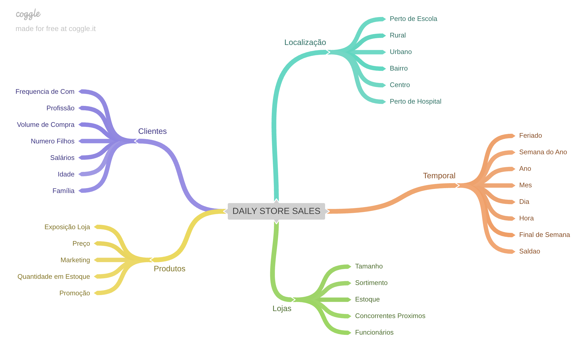
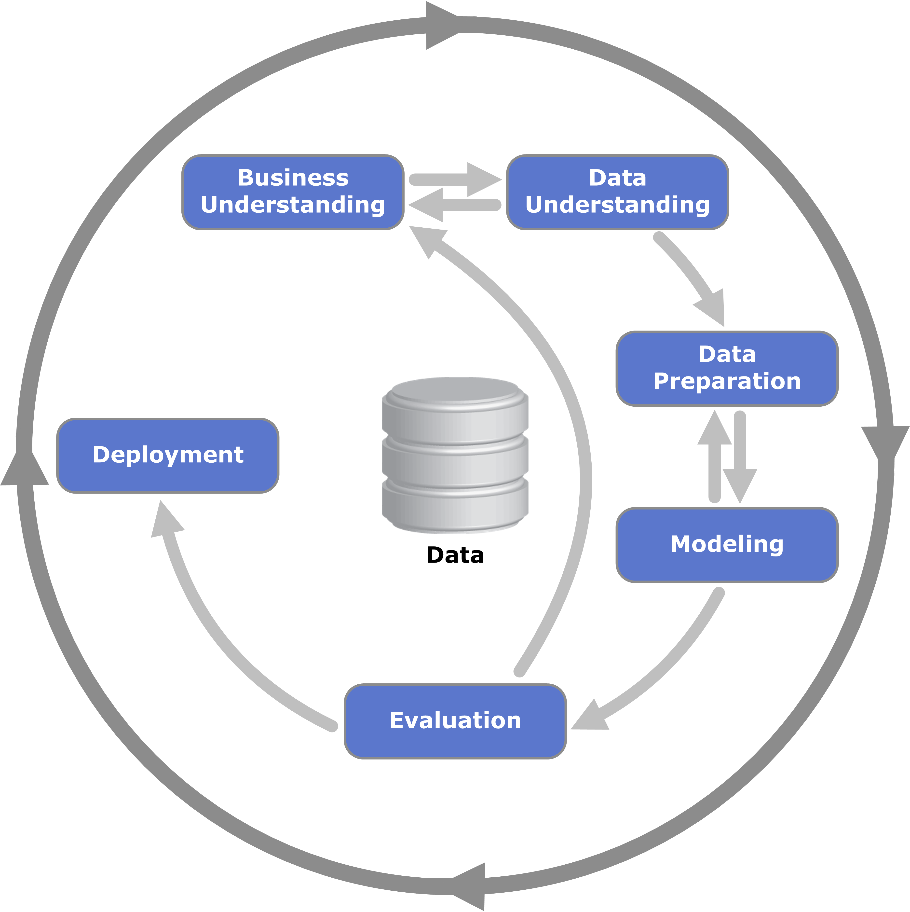
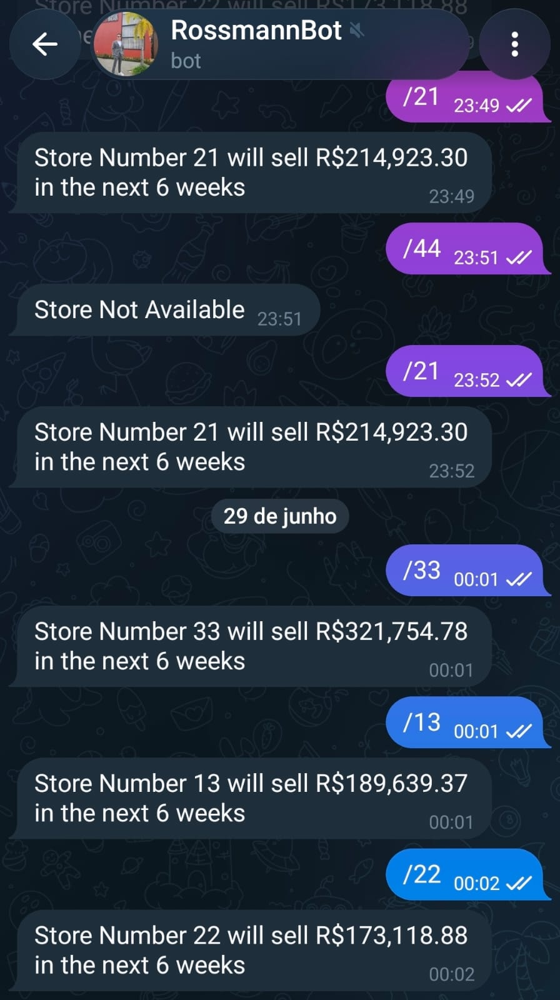

# 🏪 Rossmann Store Sales — Previsão de Vendas

Modelo de machine learning para prever as vendas das próximas 6 semanas de cada loja da rede Rossmann, com API em produção no Heroku e bot no Telegram para consulta em tempo real.

<p align="center">

</p>

---

## 🚨 Problema de Negócio

A rede Rossmann opera mais de 1.100 farmácias na Alemanha. O CFO da empresa precisava de uma previsão confiável do faturamento de cada loja para as próximas 6 semanas, com o objetivo de planejar um orçamento centralizado para reformas e melhorias nas unidades.

Até então, cada gerente de loja fornecia sua própria estimativa manualmente. Esse processo gerava previsões inconsistentes, sujeitas a erros individuais e sem base estatística, o que tornava o planejamento financeiro para o CFO pouco confiável.

**Pergunta central:** Quanto cada loja vai vender nas próximas 6 semanas?

---

## 🗺️ Planejamento da Solução

A solução foi estruturada em 10 etapas seguindo a metodologia **CRISP-DS**:

<p align="center">

</p>

<p align="center">

</p>

1. **Descrição dos dados** — análise dimensional, tipagem, identificação e tratamento de valores nulos, estatística descritiva de variáveis numéricas e categóricas.

2. **Feature Engineering** — criação de hipóteses de negócio e derivação de novas variáveis como `competition_time_month`, `promo_time_week`, extração de componentes de data (ano, mês, dia, semana do ano).

3. **Filtragem de variáveis** — remoção de linhas com lojas fechadas e colunas não disponíveis em produção.

4. **Análise exploratória de dados (EDA)** — análise univariada, bivariada e multivariada; validação das 12 hipóteses de negócio com os dados reais.

5. **Preparação dos dados** — encoding cíclico de variáveis temporais (sin/cos), RobustScaler para distância e tempo de competição, MinMaxScaler para variáveis de promoção, LabelEncoder para tipo de loja.

6. **Seleção de features** — uso do Boruta para identificar as variáveis mais relevantes para o modelo.

7. **Modelagem** — treinamento e avaliação de 5 algoritmos com cross-validation temporal.

8. **Fine Tuning** — otimização dos hiperparâmetros do XGBoost via Random Search.

9. **Tradução do erro** — conversão das métricas de erro em cenários financeiros (pessimista, esperado, otimista) por loja.

10. **Deploy em produção** — API Flask no Heroku + bot no Telegram para consulta pelo CFO.

**Ferramentas:** Python (pandas, numpy, scikit-learn, XGBoost, Flask), Heroku, Telegram Bot API.

---

## 🛠️ Desenvolvimento

### Dataset

| Atributo | Detalhe |
|---|---|
| Fonte | Competição Kaggle — Rossmann Store Sales |
| Lojas | 1.115 unidades na Alemanha |
| Período (treino) | Janeiro de 2013 a Julho de 2015 |
| Variável resposta | `Sales` — vendas diárias por loja |
| Granularidade | 1 linha = 1 dia de operação de 1 loja |

### Modelos Avaliados

| Modelo | MAE CV | MAPE CV | RMSE CV |
|---|---|---|---|
| Linear Regression | 2081.73 ± 295.63 | 0.30 ± 0.02 | 2952.52 ± 468.37 |
| Linear Regression Lasso | 2116.38 ± 341.50 | 0.29 ± 0.01 | 3057.75 ± 504.26 |
| Random Forest Regressor | 837.45 ± 218.41 | 0.12 ± 0.02 | 1255.62 ± 318.34 |
| **XGBoost Regressor** | **1076.89 ± 157.79** | **0.15 ± 0.01** | **1544.02 ± 216.12** |

O XGBoost foi escolhido em detrimento do Random Forest por apresentar **menor variância no cross-validation** e ser significativamente mais leve para deploy em produção. O delta de MAE de ~239 pontos (~28% pior) foi sacrificado conscientemente: em benchmarks locais, o XGBoost entregou **inferência ~3× mais rápida** e um modelo serializado **~10× menor** (pkl), dois requisitos críticos para uma API com timeout restrito no Heroku free tier e múltiplas requisições simultâneas vindas do bot do Telegram.

### Estrutura do Projeto

```
rossmann_store_sales/
├── assets/
│   ├── data/
│   │   ├── train.csv
│   │   ├── test.csv
│   │   └── store.csv
│   └── img/
├── models/
│   ├── ml_model/model_xgb_tunned.pkl
│   └── parameters/
├── notebooks/
│   └── datasets_analysis.ipynb
├── webapp/                          # API Flask (Heroku)
│   ├── handler.py
│   ├── rossmann/Rossmann.py
│   ├── Procfile
│   └── requirements.txt
└── rossmann-telegram-api/           # Bot Telegram (Heroku)
    ├── rossmann-bot.py
    ├── Procfile
    └── requirements.txt
```

---

## 💡 Top Insights

### 1. 🏪 Competidores próximos não reduzem as vendas — aumentam

**H2 FALSA** — O senso comum diria que lojas com concorrentes mais próximos vendem menos. Os dados mostram o oposto: lojas com competidores próximos tendem a vender **mais**. A presença de outros estabelecimentos aumenta o fluxo de pessoas na região, beneficiando todas as lojas da área.

---

### 2. 📉 Promoções prolongadas reduzem as vendas

**H4 FALSA** — Lojas com promoções ativas por mais tempo vendem menos após um determinado período. O efeito da promoção se esgota e o consumidor passa a esperar sempre o desconto antes de comprar, reduzindo o volume de vendas no preço normal.

---

### 3. 📅 Lojas vendem mais depois do dia 10 do mês

**H10 VERDADEIRA** — Há uma concentração clara de vendas na segunda quinzena do mês, coincidindo com o período pós-pagamento dos salários na Alemanha. Esse padrão é consistente e pode ser usado para planejar estoques e escala de equipe.

---

### 4. 📆 Lojas vendem menos no segundo semestre

**H9 FALSA** — Contrariando a intuição de que o segundo semestre (com datas comemorativas) aquece as vendas, os dados mostram queda consistente. O Natal, especificamente, também não impulsiona as vendas — lojas abertas no feriado faturam **menos** que em dias normais.

---

## 📊 Resultados

### Previsão Total da Rede (6 semanas)

| Cenário | Total de Vendas |
|---|---|
| Pessimista | R$ 283.505.926,53 |
| **Previsão** | **R$ 284.351.072,00** |
| Otimista | R$ 285.196.184,16 |

### Performance do Modelo Final (XGBoost Tunado)

| Métrica | Valor |
|---|---|
| MAE | ~875 |
| MAPE | ~13% |
| RMSE | ~1.265 |

### Arquitetura de Deploy

```
Usuário (Telegram)
    ↓ /22 (número da loja)
rossmann-telegram-bot (Heroku)
    ↓ POST /rossmann/predict
rossmann-store-sales API (Heroku)
    ↓ XGBoost predict
Resposta: "Store 22 will sell R$ 173,118.88 in the next 6 weeks"
```

<p align="center">

</p>

---

## ✅ Conclusões

O modelo entrega previsões com MAPE médio de **~13%** — substancialmente superior a qualquer estimativa manual por gerente de loja. A margem de erro financeira entre o cenário pessimista e otimista é de **R$ 1,69 milhão** em toda a rede, o que dá ao CFO um intervalo confiável para o planejamento de reformas.

A integração via Telegram permite que o CFO consulte a previsão de qualquer loja em segundos, sem necessidade de acesso a dashboards ou planilhas.

**Próximos passos:**
- Retreinar o modelo com dados mais recentes à medida que novos períodos ficarem disponíveis
- Explorar LGBM e CatBoost como alternativas ao XGBoost
- Adicionar alertas automáticos no bot para lojas com previsão fora do intervalo esperado

**Limitações:** O modelo foi treinado com dados até julho de 2015. Eventos macroeconômicos, mudanças de comportamento do consumidor ou abertura/fechamento de lojas após esse período não estão refletidos nas previsões.

---

*📁 Dados: Rossmann Store Sales (Kaggle) · 🏪 1.115 lojas · 🤖 XGBoost · 🚀 Heroku + Telegram*
